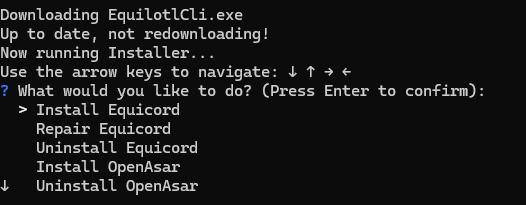
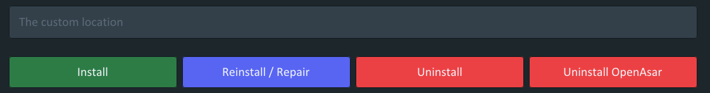

import { Steps, Tabs, TabItem } from '@astrojs/starlight/components';

## General

### Is there a mobile version?

Equicord only supports desktop. For mobile, the recommended alternatives are:

- Kettu (Android and iOS)
- Revenge (Android and iOS)
- Aliucord (Android only, uses an older version of the Discord app)

### Can I use BetterDiscord or Replugged plugins?

Not directly. However, chances are the plugin you're looking for already exists in Equicord.

### Will I get banned for using Equicord?

Client modifications are against Discord's Terms of Service, but there are no known cases of users being banned for using client mods. Avoid plugins with abusive behavior, and don't post screenshots showing Equicord in servers that prohibit mods. If your account is critical to you, it's safest not to use any mod at all.

### How do I migrate my settings from Canary to Stable (or vice versa)?

Settings are already shared across all Discord instances on the same PC, so just switch and they'll carry over automatically.

### How do I switch to a stable build?

**Equicord users:**

Just use Discord Stable instead of PTB/Canary.

**Equibop users:**

<Tabs>
    <TabItem label="DevTools (Fastest)">
        Open DevTools using `Ctrl + Shift + I` (Windows/Linux) or `Cmd + Option + I` (macOS), then paste the following code into the console and press enter:
```js
        Equibop.Settings.store.discordBranch = 'stable';
        VesktopNative.app.relaunch();
```
    </TabItem>
    <TabItem label="Manually">
        <Steps>
        1. Navigate to your settings folder:
           - Windows: `%appdata%/equibop`
           - Linux: `~/.config/equibop`
        2. Open `settings.json` in a text editor.
        3. Locate `"discordBranch"` and change its value to `"stable"`.
        4. Restart the app.
        </Steps>
    </TabItem>
</Tabs>

### Do you support unofficial packages (Nix, AUR, etc.)?

No. These packages are maintained by people unrelated to Equicord. We can't provide support for them unless the issue is a bug in the mod itself. Please reach out to the package maintainers instead.

### Do you support custom Windows distributions (AtlasOS, Tiny11, etc.)?

No. Custom Windows distributions often remove critical system components that Equicord depends on. If it works for you, great — but we can't provide support for any issues that arise.

## Troubleshooting

### Equicord stopped working. What do I do?

Your installation is most likely outdated. Check for updates using the built-in updater or the "Update Equicord" option in the installer. If that doesn't help, try reinstalling.

### Why is my Discord laggy?

The most common cause is poorly written CSS. Try temporarily disabling all themes and your QuickCSS. If that fixes it, remove parts of your CSS gradually until you find what's causing the lag.

### My themes broke and I can't open settings.

Open DevTools with `Ctrl + Shift + I` (`Cmd + Option + I` on macOS), go to the **Console** tab, and run the code below. It will disable custom CSS, copy your current themes to your clipboard as a backup, and remove all themes.

```js
(() => {
    Vencord.Settings.useQuickCss = false
    try {
        const copy = window.copy ?? Vencord.Webpack.Common.Clipboard.copy
        copy([...Vencord.Settings.enabledThemes,...Vencord.Settings.enabledThemeLinks].join("\n"))
    } catch { }
    Vencord.Settings.enabledThemes = []
    Vencord.Settings.enabledThemeLinks = []
})()
```

### Why do I get logged out after opening DevTools?

Discord removes your token from storage when DevTools is opened as a security measure. If you close Discord before closing DevTools, the token is lost and you get logged out.

**Fix:** close DevTools before closing Discord, or enable the `NoDevtoolsWarning` plugin.

### The web extension has broken or oversized icons.

This is likely caused by having both the Vencord and Equicord extensions enabled at the same time. Disable or remove the Vencord extension and use only the Equicord one. You can also try removing and re-adding the Equicord extension, or reloading the Discord page.

### The installer says "You have a broken Discord install."

You likely do have a broken installation. Reinstalling Discord usually fixes it. If not:

<Steps>
1. Press `Windows + R`, type `%PROGRAMDATA%` and press Enter.
2. Find the folder named after your username and open it.
3. Delete any folders named `Squirrel` or `Discord`. If the folder is now empty, delete it too.
4. Try opening Discord. If it doesn't start, reinstall it.
5. Confirm Discord runs and the error is gone.
</Steps>

### "A JavaScript error occurred in the main process"

This could be many things to do with the installer or Discord's JavaScript files. If your installer is out of date, **please update it!**

### "Patching C:\Users\user\AppData\Local\Discord. ERROR Didn't find desktop.asar"

Your Discord install is likely messed up. Follow these steps:

<Steps>
1. Hold the Windows key and press `R`. Type `%AppData%` and click OK.
2. Delete the Discord folder.
3. Repeat for `%LocalAppData%`.
4. Reinstall Discord using one of the links below:
   - [Main Branch (Discord)](https://discord.com/api/downloads/distributions/app/installers/latest?channel=stable&platform=win&arch=x64)
   - [PTB Branch (Discord PTB)](https://ptb.discord.com/api/downloads/distributions/app/installers/latest?channel=ptb&platform=win&arch=x64)
   - [Canary Branch (Discord Canary)](https://canary.discord.com/api/downloads/distributions/app/installers/latest?channel=canary&platform=win&arch=x64)
</Steps>

:::tip
You can also follow Discord's own guide on [fixing a corrupt installation](https://support.discord.com/hc/en-us/articles/115004307527--Windows-Corrupt-Installation).
:::

### "Something went wrong. Please check the logs above."

This is usually Windows Defender blocking Equicord's CLI installer. Disable it or add an exclusion — learn how [in this article](https://www.howtogeek.com/671233/how-to-add-exclusions-in-windows-defender-on-windows-10/).

### "Discord Activities aren't working!"

This is usually caused by OpenASAR. Simply uninject OpenASAR from Discord using the Equicord installer:

- **CLI:**
  
- **GUI:**
  

### "I'm using Equibop and it's not detecting my game(s) or programs!"

This happens because of how Equibop detects games and programs using arrpc-bun. Learn more [here](https://github.com/Creationsss/arrpc-bun).

### I have a different issue!

For any other issues, please check the [Equicord Discord server](https://equicord.org/discord) for support.